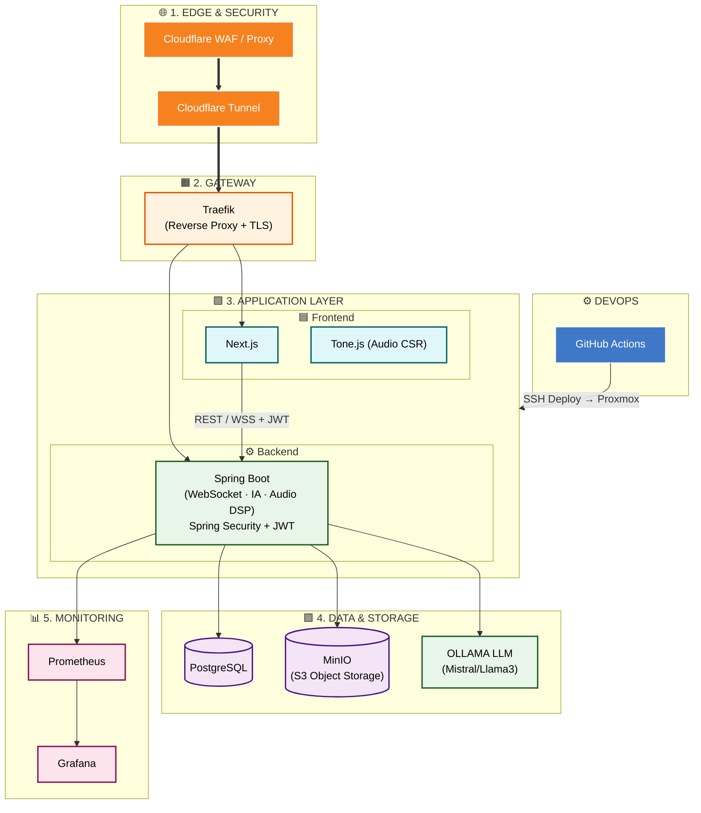

# 🎵 JustMakeIt - Backend API (Spring Boot)


> **The AI-powered music maker to resample audio & jumpstart composition. No more writer's block.**

## 📖 Overview

**justmakeit** est un "Simili-DAW" (Digital Audio Workstation) web collaboratif conçu pour transformer l'inspiration brute en production structurée. Il permet aux producteurs d'uploader des samples audio et de générer instantanément un contexte rythmique autour d'eux grâce à l'Intelligence Artificielle.

Le projet suit une approche **Self-Hosted & Cloud-Native**, privilégiant la maîtrise de l'infrastructure et la confidentialité des données (IA locale).

---

## 🏗 Architecture & Design Decisions

### Diagramme d'Architecture


### Choix Technologiques Forts
*   **Auth Backend-First** : Utilisation de **Spring Security + JWT**. L'authentification est gérée par le backend pour garantir la sécurité des WebSockets et de la persistance, le frontend (Next.js) agissant comme un client d'API stateless.
*   **Infrastructure Maîtrisée** : Remplacement de Supabase/S3 par **PostgreSQL** et **MinIO** en auto-hébergement pour réduire les dépendances externes et les coûts.
*   **IA Locale** : Utilisation de **OLLAMA** (Mistral/Llama3) via **LangChain4j**. Pas d'appels API coûteux vers OpenAI, traitement local pour une génération de patterns rapide et confidentielle.

---

## ⚙️ Configuration

Le backend s'appuie sur des variables d'environnement définies dans un fichier `.env`. Un fichier `.env.example` est fourni dans ce dossier pour référence.

### Détails des variables :
*   **DATABASE** : `POSTGRES_URL`, `POSTGRES_USER`, `POSTGRES_PASSWORD` pour la connexion à la base de données.
*   **SECURITY** : `JWT_SECRET`, clé maître pour signer les tokens de session.
*   **MINIO** : Identifiants et endpoint pour le stockage objet S3-compatible (remplace S3).
*   **OLLAMA** : `OLLAMA_BASE_URL` pointant vers l'instance LLM tournant sur Proxmox.
*   **FRONTEND** : URLs pour la gestion des CORS et les redirections.

---

## 🛠 Architecture & Stack Backend

*   **Runtime** : Java 21 / Spring Boot 3.2.5
*   **Sécurité** : Spring Security + JWT (Stateless)
*   **Collaboration** : WebSockets (STOMP) via `/ws-justmakeit`
*   **Audio DSP** : TarsosDSP pour l'analyse BPM, key detection et time-stretching.
*   **IA** : LangChain4j intégrant **OLLAMA** (Mistral/Llama3) local.
*   **Stockage Objets** : MinIO (compatible S3 API) pour les samples audio.
*   **Base de Données** : PostgreSQL.

---

## 🚀 Fonctionnalités Clés du Backend

- **Collaboration Temps Réel** : Synchronisation entre collaborateurs via WebSockets.
- **AI Co-Producer** : Génération de patterns rythmiques (Kick, Snare, Hi-Hats) via LLM (JSON output).
- **Zéro Compte (Optionnel)** : Identification initiale via `deviceId` avec pseudonymes automatiques.
- **Authentification Avancée** : Comptes utilisateurs persistants avec sécurité JWT pour la sauvegarde.
- **Analyse Audio (DSP)** : Extraction de BPM et de métadonnées audio.
- **Export MIDI** : Génération de fichiers MIDI exportables vers Ableton / FL Studio.

---

## 🚀 Roadmap & Chantiers

### 🏗 Chantier 1 : Infrastructure (Fondations)
- [ ] **Docker Compose Global** : Configuration de Backend + PostgreSQL + MinIO + Traefik + OLLAMA + Prometheus + Grafana.
- [ ] **CI/CD** : GitHub Actions pour Build -> Test -> SSH Deploy sur Proxmox.

### 🔐 Chantier 2 : Authentification (Sécurité)
- [ ] **Backend Security** : Mise en place de Spring Security avec validation JWT.
- [ ] **Flow d'Auth** : Route publique (deviceId) vs Route protégée (account).

### 🤖 Chantier 3 : IA & Intelligence (Cœur)
- [ ] **OLLAMA Setup** : Déploiement du modèle Mistral/Llama3 sur Proxmox.
- [ ] **Prompt Engineering** : Génération de patterns rythmiques au format JSON structuré.

### ✅ Chantier 4 : Qualité & Documentation
- [ ] **Tests Automatisés** : JUnit sur la logique BPM et génération IA.
- [ ] **Documentation API** : OpenAPI/Swagger activé.
- [ ] **Sécurité API** : Validation MIME, Rate Limiting, WS Auth.

### 🎵 Chantier 5 : Features & Polish
- [ ] **Time-stretching DSP** : Adaptation automatique du sample au BPM.
- [ ] **Export MIDI** : Feature de génération de fichiers MIDI.

---

## 📂 Organisation du Projet

*   `config` : Configuration Spring Security, WebSocket, S3 (MinIO), OLLAMA.
*   `controller` : Endpoints REST et WebSocket handlers.
*   `service` : Logique métier (IA, Audio Processing, Management des salons).
*   `repository` / `model` : Persistance PostgreSQL.

---

## 🏃 Démarrage Local

### 1. Lancer l'infrastructure
Depuis ce dossier :
```bash
docker-compose up -d
```

### 2. Configurer l'environnement
Copiez le fichier `.env.example` en `.env` (dans ce dossier) et renseignez les variables.

### 3. Lancer le Backend
```bash
./mvnw spring-boot:run
```

### 💻 Note sur le Frontend
L'interface utilisateur se trouve dans le repository séparé `justmakeit-front`.
Consultez son README dédié pour les instructions de lancement.

---
*Built by [Maxime Zoppini] - 2026*